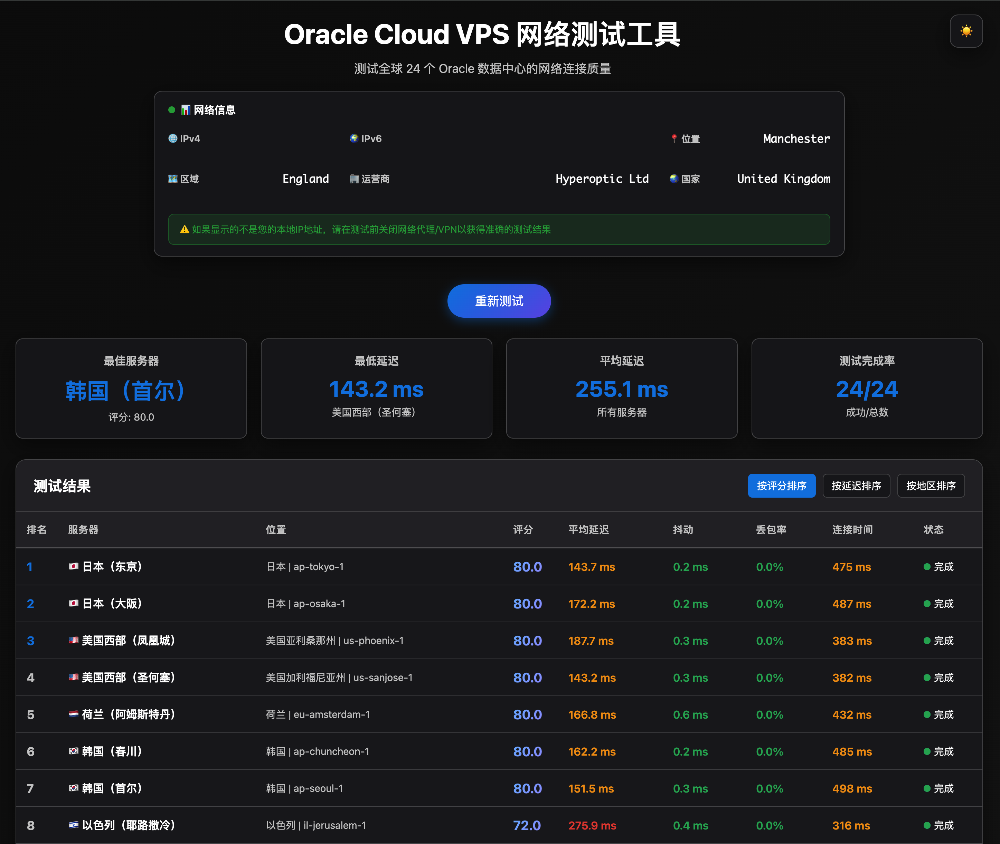
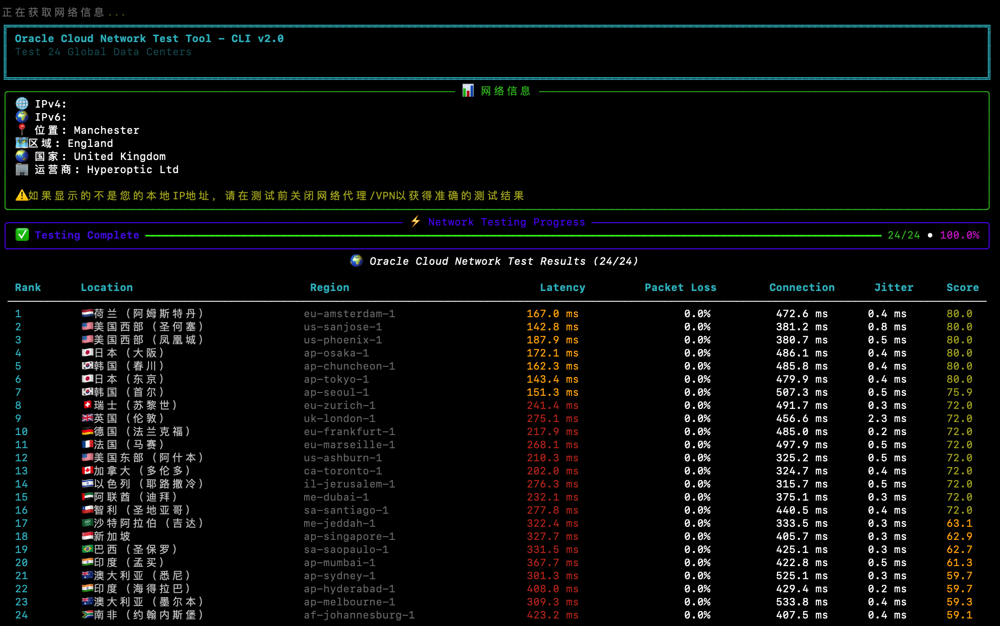

# Oracle Cloud Network Test Tool 🌍

<div align="center">

[](https://opensource.org/licenses/MIT)
[](https://www.python.org/)
[](https://www.docker.com/)
[](https://github.com/psf/black)
[](https://github.com/RickeyRen/oracle-cloud-network-tester/stargazers)
[](https://github.com/RickeyRen/oracle-cloud-network-tester/network/members)

**🚀 一个强大的工具，用于测试 Oracle Cloud 全球 24 个数据中心的网络性能**

*支持 Web 界面和命令行两种使用方式，提供详细的网络性能分析和智能推荐*

[🎯 快速开始](#-快速开始) • 
[📊 在线演示](#-预览截图) • 
[🛠️ 安装指南](#-详细安装) • 
[📖 使用文档](#-使用指南) • 
[🤝 参与贡献](#-贡献)

</div>

---

## 🌟 主要特性

<table>
<tr>
<td>

**🌍 全球覆盖**  
测试 24 个 Oracle Cloud 数据中心  
涵盖美洲、欧洲、亚太、中东非洲

</td>
<td>

**⚡ 极速测试**  
使用多线程并发测试  
60-120秒完成全部测试

</td>
</tr>
<tr>
<td>

**📊 实时监控**  
动态显示测试进度  
实时更新结果排名

</td>
<td>

**🎯 智能推荐**  
根据使用场景推荐最佳区域  
支持游戏、流媒体、下载场景

</td>
</tr>
<tr>
<td>

**🔍 详细分析**  
延迟、丢包率、连接时间、抖动  
公网IP地址和地理位置显示

</td>
<td>

**🎨 现代界面**  
响应式设计，流畅动画  
支持多种导出格式

</td>
</tr>
</table>

## 📊 预览截图

### 🖥️ Web 界面
> 现代化的响应式 Web 界面，支持实时测试和结果展示



*Web 界面特点：实时进度条、动态排序、详细网络信息、一键测试*

### 💻 命令行界面 
> 功能完整的 CLI 工具，支持批量测试和结果导出



*CLI 特点：Rich 样式美化、进度条显示、彩色结果表格、多格式导出*

## 🚀 快速开始

### 方式一：Docker (推荐 ⭐)

```bash
# 一键启动 Web 服务
docker-compose up -d

# 访问 http://localhost:5001
```

### 方式二：本地安装

```bash
# 1. 克隆项目
git clone https://github.com/RickeyRen/oracle-cloud-network-tester.git
cd oracle-cloud-network-tester

# 2. 安装依赖
pip install -r requirements.txt

# 3. 启动服务
python app.py                    # Web 版本
python cli.py                    # CLI 版本
```

## 🛠️ 详细安装

<details>
<summary><strong>📦 系统要求</strong></summary>

### 最低配置
- **操作系统**: macOS / Linux / Windows
- **Python**: 3.9+ 
- **内存**: 512MB
- **网络**: 需要互联网连接和 ping 权限

### 推荐配置  
- **操作系统**: Ubuntu 20.04+ / macOS Big Sur+
- **Python**: 3.11+
- **内存**: 1GB+
- **网络**: 低延迟网络环境

</details>

<details>
<summary><strong>🐳 Docker 部署</strong></summary>

### 使用 Docker Compose (推荐)
```bash
# 下载配置文件
curl -O https://raw.githubusercontent.com/RickeyRen/oracle-cloud-network-tester/main/docker-compose.yml

# 一键部署
docker-compose up -d

# 查看运行状态
docker-compose ps

# 停止服务
docker-compose down
```

### 使用 Docker
```bash
# 构建镜像
docker build -t oracle-network-test .

# 运行容器
docker run -d \
  --name oracle-test \
  -p 5001:5001 \
  oracle-network-test

# 查看日志
docker logs oracle-test
```

</details>

<details>
<summary><strong>🔧 从源码安装</strong></summary>

### 1. 获取源码
```bash
# 方式一：Git Clone
git clone https://github.com/RickeyRen/oracle-cloud-network-tester.git
cd oracle-cloud-network-tester

# 方式二：下载 ZIP
wget https://github.com/RickeyRen/oracle-cloud-network-tester/archive/main.zip
unzip main.zip && cd oracle-network-test-main
```

### 2. 环境配置
```bash
# 创建虚拟环境 (推荐)
python -m venv venv

# 激活虚拟环境
source venv/bin/activate        # Linux/macOS
# 或 venv\Scripts\activate     # Windows

# 升级 pip
pip install --upgrade pip

# 安装依赖
pip install -r requirements.txt
```

### 3. 运行应用
```bash
# Web 服务 (推荐)
python app.py
# 访问 http://localhost:5001

# 命令行工具
python cli.py --help
```

</details>

## 📖 使用指南

### 🌐 Web 界面使用

1. **启动服务**: `python app.py` 或 `docker-compose up -d`
2. **打开浏览器**: 访问 `http://localhost:5001`
3. **开始测试**: 点击 "开始测试" 按钮
4. **查看结果**: 实时查看测试进度和结果排名
5. **分析数据**: 根据评分选择最适合的 Oracle 区域

### 💻 CLI 工具使用

<details>
<summary><strong>基础命令</strong></summary>

```bash
# 测试所有区域 (默认)
python cli.py

# 测试特定区域
python cli.py --regions us-ashburn-1 ap-tokyo-1

# 显示前 N 名结果
python cli.py --top 5

# 安静模式 (最少输出)
python cli.py --quiet

# 跳过 IP 信息显示
python cli.py --no-ip
```

</details>

<details>
<summary><strong>导出和推荐功能</strong></summary>

```bash
# 导出为 JSON 格式
python cli.py --export json -o results.json

# 导出为 CSV 格式  
python cli.py --export csv -o results.csv

# 导出为 Markdown 格式
python cli.py --export markdown -o results.md

# 获取游戏推荐 (低延迟优化)
python cli.py --recommend gaming

# 获取流媒体推荐 (低丢包优化)
python cli.py --recommend streaming

# 获取下载推荐 (快速连接优化)
python cli.py --recommend download

# 综合推荐 (平衡所有指标)
python cli.py --recommend general
```

</details>

<details>
<summary><strong>高级用法</strong></summary>

```bash
# 组合使用：测试特定区域并导出前3名
python cli.py --regions us-ashburn-1 us-phoenix-1 ap-tokyo-1 \
              --top 3 \
              --export json -o top3-results.json \
              --recommend gaming

# 批处理：测试并生成完整报告
python cli.py --export markdown -o network-report.md && \
python cli.py --recommend gaming && \
python cli.py --recommend streaming
```

</details>

## 🌐 测试的服务器位置

<details>
<summary><strong>🌎 美洲地区 (6个节点)</strong></summary>

| 地区 | 代码 | 城市 |
|------|------|------|
| 🇺🇸 美国东部 | `us-ashburn-1` | 阿什本 |
| 🇺🇸 美国西部 | `us-phoenix-1` | 凤凰城 |
| 🇺🇸 美国西部 | `us-sanjose-1` | 圣何塞 |
| 🇨🇦 加拿大 | `ca-toronto-1` | 多伦多 |
| 🇧🇷 巴西 | `sa-saopaulo-1` | 圣保罗 |
| 🇨🇱 智利 | `sa-santiago-1` | 圣地亚哥 |

</details>

<details>
<summary><strong>🌍 欧洲地区 (5个节点)</strong></summary>

| 地区 | 代码 | 城市 |
|------|------|------|
| 🇬🇧 英国 | `uk-london-1` | 伦敦 |
| 🇩🇪 德国 | `eu-frankfurt-1` | 法兰克福 |
| 🇨🇭 瑞士 | `eu-zurich-1` | 苏黎世 |
| 🇳🇱 荷兰 | `eu-amsterdam-1` | 阿姆斯特丹 |
| 🇫🇷 法国 | `eu-marseille-1` | 马赛 |

</details>

<details>
<summary><strong>🌏 亚太地区 (9个节点)</strong></summary>

| 地区 | 代码 | 城市 |
|------|------|------|
| 🇯🇵 日本 | `ap-tokyo-1` | 东京 |
| 🇯🇵 日本 | `ap-osaka-1` | 大阪 |
| 🇰🇷 韩国 | `ap-seoul-1` | 首尔 |
| 🇰🇷 韩国 | `ap-chuncheon-1` | 春川 |
| 🇸🇬 新加坡 | `ap-singapore-1` | 新加坡 |
| 🇮🇳 印度 | `ap-mumbai-1` | 孟买 |
| 🇮🇳 印度 | `ap-hyderabad-1` | 海得拉巴 |
| 🇦🇺 澳大利亚 | `ap-melbourne-1` | 墨尔本 |
| 🇦🇺 澳大利亚 | `ap-sydney-1` | 悉尼 |

</details>

<details>
<summary><strong>🌍 中东非洲地区 (4个节点)</strong></summary>

| 地区 | 代码 | 城市 |
|------|------|------|
| 🇸🇦 沙特阿拉伯 | `me-jeddah-1` | 吉达 |
| 🇦🇪 阿联酋 | `me-dubai-1` | 迪拜 |
| 🇮🇱 以色列 | `il-jerusalem-1` | 耶路撒冷 |
| 🇿🇦 南非 | `af-johannesburg-1` | 约翰内斯堡 |

</details>

## 📊 评分体系

### 🎯 综合评分算法
我们使用科学的加权评分系统，确保推荐结果的准确性：

```
总分 = 延迟得分×40% + 丢包率得分×30% + 连接时间得分×20% + 抖动得分×10%
```

### 📈 各项指标详解

<details>
<summary><strong>⚡ 延迟 (Latency) - 权重 40%</strong></summary>

**定义**: ICMP Ping 响应时间的平均值 (10次测试)  
**单位**: 毫秒 (ms)  
**评分标准**:
- `< 50ms` → 100分 🟢 (优秀)
- `50-100ms` → 90分 🟡 (良好)  
- `100-200ms` → 70分 🟠 (一般)
- `200-300ms` → 50分 🔴 (较差)
- `> 300ms` → 30分 ⚫ (很差)

</details>

<details>
<summary><strong>📉 丢包率 (Packet Loss) - 权重 30%</strong></summary>

**定义**: 数据包丢失的百分比  
**单位**: 百分比 (%)  
**评分标准**:
- `0%` → 100分 🟢 (完美)
- `每增加 0.5%` → 扣1分
- `> 15%` → 0分 ⚫ (不可用)

</details>

<details>
<summary><strong>🔗 连接时间 (Connection Time) - 权重 20%</strong></summary>

**定义**: HTTPS 连接建立时间的平均值 (5次测试)  
**单位**: 毫秒 (ms)  
**评分标准**:
- `< 100ms` → 100分 🟢 (优秀)
- `100-200ms` → 80分 🟡 (良好)
- `200-500ms` → 60分 🟠 (一般)  
- `> 500ms` → 40分 🔴 (较差)

</details>

<details>
<summary><strong>📊 抖动 (Jitter) - 权重 10%</strong></summary>

**定义**: 延迟的标准差，反映网络稳定性  
**单位**: 毫秒 (ms)  
**评分标准**:
- `< 5ms` → 100分 🟢 (非常稳定)
- `5-10ms` → 80分 🟡 (稳定)
- `10-20ms` → 60分 🟠 (一般)
- `> 20ms` → 40分 🔴 (不稳定)

</details>

## 🏗️ 技术架构

### 🔧 技术栈

<table>
<tr>
<td><strong>后端框架</strong></td>
<td>Python 3.9+ • Flask 3.0 • asyncio</td>
</tr>
<tr>
<td><strong>前端技术</strong></td>
<td>HTML5 • CSS3 • Vanilla JavaScript</td>
</tr>
<tr>
<td><strong>网络测试</strong></td>
<td>subprocess (ping) • aiohttp (HTTPS)</td>
</tr>
<tr>
<td><strong>并发处理</strong></td>
<td>ThreadPoolExecutor • asyncio.gather</td>
</tr>
<tr>
<td><strong>CLI 美化</strong></td>
<td>Rich • Progress • Table</td>
</tr>
<tr>
<td><strong>容器化</strong></td>
<td>Docker • Docker Compose</td>
</tr>
</table>

### 📁 项目结构

```
oracle-network-test/
├── 📁 src/                      # 核心模块
│   ├── __init__.py             # 包初始化和配置
│   ├── config.py               # 服务器配置管理  
│   ├── network_tester.py       # 网络测试核心逻辑
│   └── utils.py                # 工具函数集合
├── 📁 templates/               # Web 模板
│   └── index.html              # 主页面模板
├── 📁 .github/                 # GitHub 配置
│   ├── ISSUE_TEMPLATE/         # Issue 模板
│   └── PULL_REQUEST_TEMPLATE.md # PR 模板
├── 📁 screenshots/             # 项目截图
│   ├── web-interface.png       # Web 界面截图
│   └── cli-interface.png       # CLI 界面截图
├── 🐍 app.py                   # Web 应用主程序
├── 💻 cli.py                   # CLI 应用主程序
├── 🐳 Dockerfile              # Docker 镜像配置
├── 🐳 docker-compose.yml      # Docker Compose 配置
├── 📋 requirements.txt         # Python 依赖包
├── ⚖️ LICENSE                  # MIT 许可证
├── 🤝 CONTRIBUTING.md          # 贡献指南
├── 📜 CODE_OF_CONDUCT.md       # 行为准则
├── 📝 CHANGELOG.md             # 版本更新记录
└── 📖 README.md                # 项目说明文档
```

### 🔄 架构设计亮点

<details>
<summary><strong>🚀 性能优化</strong></summary>

- **异步并发**: 使用 `asyncio` + `ThreadPoolExecutor` 同时测试多个服务器
- **线程隔离**: Flask 主线程与测试线程分离，避免阻塞
- **智能重试**: 网络失败自动重试，提高测试成功率
- **内存优化**: 流式处理测试结果，避免内存堆积

</details>

<details>
<summary><strong>🎨 用户体验</strong></summary>

- **实时更新**: 边测试边更新结果，无需等待全部完成
- **无闪烁更新**: 只更新变化的表格行，避免整体重绘
- **响应式设计**: 适配各种屏幕尺寸和设备
- **富文本终端**: CLI 使用 Rich 库美化输出

</details>

<details>
<summary><strong>🛡️ 容错设计</strong></summary>

- **异常隔离**: 单个服务器测试失败不影响整体测试
- **超时机制**: 防止长时间等待无响应的服务器
- **数据验证**: 严格的输入输出数据验证
- **优雅降级**: 部分功能失败时仍能正常运行

</details>

## ⚠️ 重要说明

### 🎯 测试结果说明
- **本地运行**: 反映您的网络环境到 Oracle 各节点的真实连接质量
- **VPS 部署**: 反映部署服务器到 Oracle 各节点的连接质量  
- **代理影响**: 如果使用网络代理，可能影响测试结果的准确性

### 🚨 使用注意事项
- 测试需要管理员权限以执行 ping 命令
- 防火墙可能阻止部分测试，请确保网络连通性
- 建议在网络空闲时进行测试以获得最佳结果
- 测试过程中请保持网络连接稳定

## 🚀 版本历史

### 🎉 v2.0.0 (2025-08-14) - 重大升级
- ✨ **新增**: 完整的 CLI 工具支持
- 🏗️ **重构**: 模块化架构，提高代码可维护性
- 🐳 **新增**: Docker 和 Docker Compose 支持
- 📊 **新增**: 多格式导出功能 (JSON/CSV/Markdown)
- 🎯 **新增**: 智能场景推荐功能
- 🎨 **改进**: Rich 库美化 CLI 输出
- 📚 **完善**: 开源项目规范化

### 🔧 v1.0.0 (2025-08-04) - 首个稳定版
- ⚡ **优化**: 实现并发测试，测试时间从4分钟缩短至60-120秒
- 🌐 **新增**: 公网IP地址和地理位置显示
- 🎨 **修复**: 解决页面闪动问题，改为单行更新
- 📊 **新增**: 动态排序功能，实时显示排名变化
- 🏗️ **整理**: 项目文件结构规范化

查看完整更新日志: [CHANGELOG.md](./CHANGELOG.md)

## 🤝 贡献

我们欢迎并感谢任何形式的贡献！🎉

### 🚀 快速贡献

<details>
<summary><strong>🐛 报告 Bug</strong></summary>

发现问题了吗？请帮助我们改进：

1. 🔍 检查 [现有 Issues](https://github.com/RickeyRen/oracle-cloud-network-tester/issues) 避免重复
2. 📝 使用 Bug Report 模板创建新 Issue
3. 📋 提供详细的复现步骤和环境信息
4. 🖼️ 如可能，请附上截图或错误日志

[📝 报告 Bug](https://github.com/RickeyRen/oracle-cloud-network-tester/issues/new?template=bug_report.md)

</details>

<details>
<summary><strong>💡 功能请求</strong></summary>

有好的想法吗？我们很乐意听到：

1. 🔍 检查是否已有相似的功能请求
2. 📝 使用 Feature Request 模板
3. 💭 详细描述功能需求和使用场景
4. 🎯 说明这个功能的价值和重要性

[💡 请求功能](https://github.com/RickeyRen/oracle-cloud-network-tester/issues/new?template=feature_request.md)

</details>

<details>
<summary><strong>🔧 代码贡献</strong></summary>

想要贡献代码？太棒了！

```bash
# 1. Fork 项目到你的 GitHub 账户
# 2. 克隆你的 Fork
git clone https://github.com/RickeyRen/oracle-cloud-network-tester.git
cd oracle-cloud-network-tester

# 3. 创建特性分支
git checkout -b feature/amazing-feature

# 4. 设置开发环境
python -m venv venv
source venv/bin/activate  # Windows: venv\Scripts\activate
pip install -r requirements.txt

# 5. 进行修改和测试
# 6. 提交更改
git add .
git commit -m "feat: add amazing feature"

# 7. 推送到你的 Fork
git push origin feature/amazing-feature

# 8. 创建 Pull Request
```

详细指南: [CONTRIBUTING.md](./CONTRIBUTING.md)

</details>

### 🌟 贡献者

感谢所有为这个项目做出贡献的开发者：

<!-- 这里将来可以添加贡献者列表 -->
<a href="https://github.com/RickeyRen/oracle-cloud-network-tester/graphs/contributors">
  
</a>

## 📄 许可证

本项目基于 MIT 许可证开源 - 查看 [LICENSE](./LICENSE) 文件了解详情。

### MIT 许可证简述
✅ 商业使用  
✅ 修改  
✅ 分发  
✅ 私人使用  

❌ 责任  
❌ 保证  

## 📞 支持与联系

### 🆘 获取帮助

- 📚 **文档**: 查看本 README 和 [贡献指南](./CONTRIBUTING.md)
- 🐛 **Bug 报告**: [GitHub Issues](https://github.com/RickeyRen/oracle-cloud-network-tester/issues)
- 💬 **讨论**: [GitHub Discussions](https://github.com/RickeyRen/oracle-cloud-network-tester/discussions)
- 📧 **邮件**: [your-email@example.com](mailto:your-email@example.com)

### 🤝 社区

- 💻 **开发交流**: [GitHub Discussions](https://github.com/RickeyRen/oracle-cloud-network-tester/discussions)
- 🔄 **贡献代码**: [Pull Requests](https://github.com/RickeyRen/oracle-cloud-network-tester/pulls)
- ⭐ **关注更新**: Watch 本仓库获取最新动态

---

<div align="center">

### 🌟 如果这个项目对你有帮助，请给个 Star！

[](https://github.com/RickeyRen/oracle-cloud-network-tester/stargazers)
[](https://github.com/RickeyRen/oracle-cloud-network-tester/network/members)

**Made with ❤️ by Oracle Network Test Contributors**

*[⬆ 回到顶部](#oracle-cloud-network-test-tool-)*

</div>